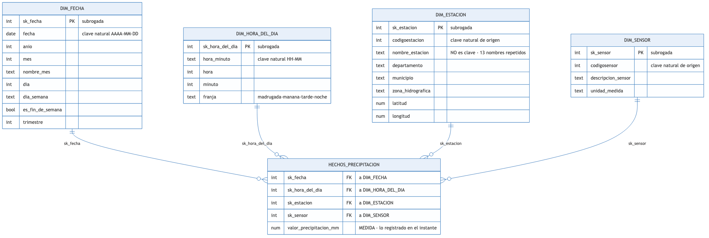
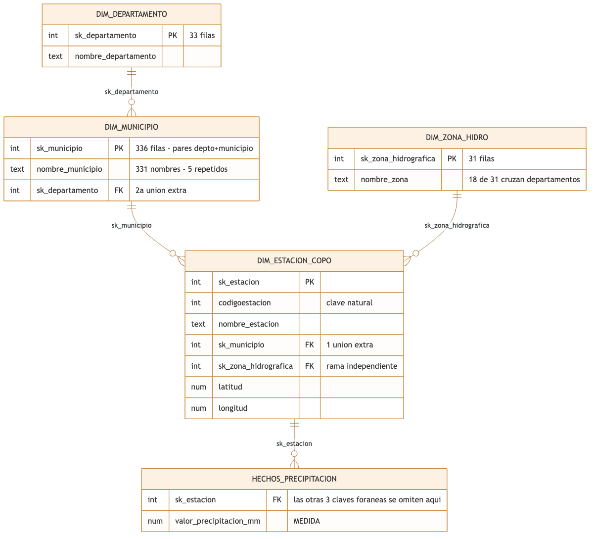

# T10 · Modelo lógico dimensional del proyecto

**Equipo:** `bigdata-ean-ideam`
**Integrantes:** Juan Pablo Castro, Camilo Rojas, Lina Ramírez
**Proyecto:** Plataforma de datos de precipitación del IDEAM (`s54a-sgyg`)
**Fecha:** 2026-09-22

> El modelo vive en la **capa curada** del lago (`lago-curado`), que es el destino analítico que definieron [T5](T5_lago.md) y la arquitectura de [T8](T8_arquitectura.md). Que ese destino sea un lago por capas y no un almacén ni un lakehouse es la decisión registrada en el [ADR 0001 de T9](adr/0001-almacenamiento.md), y tiene una consecuencia directa sobre este modelo: al no haber transacciones de tabla, la materialización de la estrella —tarea de la sesión 19— tendrá que ser idempotente por reejecución desde la capa refinada, no confiar en poder revertir una carga. Los atributos y las medidas salen de la fuente perfilada en [T1](T1/ficha_tecnica.md).

---

## 1. El grano

**Grano:** una fila es la observación de precipitación que un sensor de una estación registró en un instante.

**Por qué este grano y no uno más grueso.** Es el evento más detallado que la fuente publica: por debajo no hay nada que medir. Desde aquí se puede agregar hacia arriba —a hora, a día, a mes, a departamento— pero desde un grano diario no se podría bajar. Elegir el grano fino no es exceso de detalle: es lo único que deja abiertas las preguntas que todavía no se han hecho.

**Este grano no se afirma, está verificado.** T1 comprobó sobre la partición del 22 de junio de 2026 que la combinación `codigoestacion` + `codigosensor` + `fechaobservacion` produce **141.007 combinaciones únicas en 141.007 filas, con 0 filas duplicadas y 0 nulos** en los tres campos (`docs/T1/evidencia/verificacion_clave.csv`). Es decir: no existen dos observaciones del mismo sensor de la misma estación en el mismo instante. El grano declarado identifica una fila y solo una, así que la tabla de hechos no puede contar dos veces la misma lluvia.

---

## 2. La tabla de hechos

| `hechos_precipitacion` | Tipo | Descripción |
|---|---|---|
| `sk_fecha` | Clave foránea | Enlaza con `dim_fecha` |
| `sk_hora_del_dia` | Clave foránea | Enlaza con `dim_hora_del_dia` |
| `sk_estacion` | Clave foránea | Enlaza con `dim_estacion` |
| `sk_sensor` | Clave foránea | Enlaza con `dim_sensor` |
| `valor_precipitacion_mm` | Medida | Precipitación registrada en ese instante, en milímetros (`valorobservado` de la fuente) |

**Una sola medida, y es deliberado.** La fuente tiene 12 columnas, pero solo una es un número que se suma o se promedia con sentido: `valorobservado`. Las otras once describen *quién*, *dónde* y *cuándo*, y por eso son atributos de dimensión, no medidas. Añadir una segunda medida solo para llenar la tabla sería inventarla.

Se consideró y se descartó un contador `conteo_observaciones` fijo en 1, que Kimball admite para facilitar los conteos. No aporta nada que `count(*)` no dé ya, y ocuparía una columna por cada una de las 141.007 filas diarias.

**Verificación de que toda medida existe al grano.** `valor_precipitacion_mm` es exactamente lo que el sensor registró en ese instante: no es una suma, ni un promedio, ni un acumulado. No requiere agregación previa para existir a este grano, que es la prueba que la medida debe pasar. Una medida como «precipitación promedio mensual del departamento» **no cabría aquí**, porque no existe al nivel de un instante: sería otra tabla de hechos, con otro grano.

---

## 3. Las dimensiones

Cuatro dimensiones, todas planas y conectadas directo a la tabla de hechos. Las tres primeras se corresponden una a una con los tres componentes de la clave candidata verificada en T1; la cuarta es la partición natural del tiempo en fecha y hora del día.

### `dim_fecha`
- **Clave subrogada:** `sk_fecha`
- **Clave de origen conservada como atributo:** `fecha` (la parte de fecha de `fechaobservacion`, en formato AAAA-MM-DD)
- **Atributos:** `anio`, `mes`, `nombre_mes`, `dia`, `dia_semana`, `es_fin_de_semana`, `trimestre`
- **Tamaño:** unas 365 filas por año de histórico
- **Por qué es conformada:** cualquier proceso futuro que se mida en el tiempo —caudal, calidad del agua, mantenimiento de estaciones— se cuelga de esta misma dimensión sin crear otra

### `dim_hora_del_dia`
- **Clave subrogada:** `sk_hora_del_dia`
- **Clave de origen conservada como atributo:** `hora_minuto` (la parte de hora de `fechaobservacion`, en formato HH:MM)
- **Atributos:** `hora`, `minuto`, `franja` (madrugada, mañana, tarde, noche)
- **Tamaño:** **1.440 filas, fijas para siempre** — un minuto del día no cambia con el calendario
- **Por qué va separada de `dim_fecha`:** el grano es de minuto, así que una única dimensión de tiempo tendría que crecer **525.600 filas por año** para representar cada instante. Separada en fecha y hora del día, el mismo modelo cuesta 365 filas al año más 1.440 que nunca crecen. La medición de T1 respalda la resolución de minuto: la moda del intervalo entre observaciones es de **1 minuto** (44,16 % de los casos)

### `dim_estacion`
- **Clave subrogada:** `sk_estacion`
- **Clave de origen conservada como atributo:** `codigoestacion`
- **Atributos:** `nombre_estacion`, `departamento`, `municipio`, `zona_hidrografica`, `latitud`, `longitud`
- **Tamaño:** **524 filas medidas** en la partición del 22 de junio de 2026
- **Por qué la clave subrogada no es opcional aquí:** `nombre_estacion` **no identifica** una estación. Se midió que **13 nombres están compartidos por más de un código**: SAN PEDRO y SANTA MARÍA los usan 3 estaciones distintas cada uno, y otros 11 nombres los usan 2. Por eso hay 524 códigos pero solo 509 nombres distintos. Enlazar los hechos por el nombre fundiría estaciones que no tienen nada que ver
- **Por qué es conformada:** la red de estaciones del IDEAM mide más cosas que lluvia; cualquier otra tabla de hechos sobre esas estaciones reutiliza esta dimensión

### `dim_sensor`
- **Clave subrogada:** `sk_sensor`
- **Clave de origen conservada como atributo:** `codigosensor`
- **Atributos:** `descripcion_sensor`, `unidad_medida`
- **Tamaño:** **2 filas medidas** — `0240` (PRECIPITACIÓN, 127.894 observaciones) y `0257` (GPRS - PRECIPITACIÓN, 13.113 observaciones), ambos en milímetros
- **Nota honesta sobre su tamaño:** con dos filas, esta dimensión está en el límite de lo que valdría la pena separar, y podría defenderse como dimensión degenerada dentro de los hechos. Se mantiene como dimensión propia por dos razones: `codigosensor` es parte de la clave candidata verificada en T1, así que pertenece al grano; y el catálogo de sensores del IDEAM es abierto, de modo que una fuente que mañana publique un tercer tipo de sensor entra como una fila nueva en vez de obligar a cambiar la tabla de hechos

**Verificación de que toda dimensión aplica a cada fila.** T1 midió la proporción de nulos de las 12 columnas de la fuente en dos particiones distintas: **0,0 en todas** (`docs/T1/evidencia/comparacion_esquema.csv`). No existe una observación sin estación, sin sensor o sin instante, así que ninguna de las cuatro claves foráneas puede quedar vacía. Esta es la tercera prueba del grano, y la pasa con evidencia medida, no por supuesto.

---

## 4. El diagrama del esquema estrella

Archivo editable en el repositorio: [`practica/s10-dimensional/modelo_estrella.drawio`](../practica/s10-dimensional/modelo_estrella.drawio), más la fuente [`modelo_estrella.mmd`](../practica/s10-dimensional/modelo_estrella.mmd) con la que se generó la imagen.

Las cuatro dimensiones conectan **directo** al centro, sin subtablas intermedias: eso es lo que hace estrella al esquema. Ninguna medida quedó dentro de una dimensión y ningún atributo descriptivo quedó dentro de los hechos.

---

## 5. Nivel Frontera, si lo abordaron

**Dimensión elegida:** `dim_estacion`, normalizada separando su geografía.

Fuente editable: [`practica/s10-dimensional/copo_de_nieve.mmd`](../practica/s10-dimensional/copo_de_nieve.mmd).

**Cómo quedó normalizada.** `dim_estacion` deja de contener la geografía y apunta a `dim_municipio` (336 filas), que a su vez apunta a `dim_departamento` (33 filas). La zona hidrográfica sale como una **rama aparte**, `dim_zona_hidrografica` (31 filas), colgada directamente de la estación.

**Por qué no conviene en este proyecto.** Tres razones, todas medidas.

*Primera: no hay casi nada que ahorrar.* `dim_estacion` tiene **524 filas**. Lo que la normalización evita es repetir tres cadenas de texto en esas 524 filas —del orden de decenas de kilobytes en total—, frente a una tabla de hechos de 141.007 filas **por día**. El ahorro es invisible; el copo de nieve se justifica cuando la repetición pesa de verdad en el almacenamiento, y aquí no pesa.

*Segunda: el costo cae justo sobre la consulta principal del proyecto.* La pregunta de negocio que el equipo viene sosteniendo desde T4 es la precipitación promedio **por departamento**. Con el esquema estrella, esa consulta cruza hechos con una dimensión. Con el copo de nieve, cruza hechos con `dim_estacion`, luego con `dim_municipio`, luego con `dim_departamento`: **dos uniones más en la consulta que más se ejecuta**.

*Tercera, y la que decide: la jerarquía que parecía obvia no existe.* Al medirla contra la fuente se encontró que **18 de las 31 zonas hidrográficas cruzan más de un departamento** — MEDIO MAGDALENA toca 9 departamentos, CAUCA toca 7, META toca 6. La zona hidrográfica **no es un nivel por debajo del departamento**: son dos formas independientes de agrupar la misma estación, porque una cuenca sigue el agua y un departamento sigue una frontera política. Normalizar la geografía en una sola cadena `zona → departamento → municipio` codificaría en el modelo una jerarquía que el dato desmiente.

De paso apareció un segundo hallazgo que refuerza las claves subrogadas: **5 nombres de municipio existen en dos departamentos a la vez** (ARMENIA, BUENAVISTA, CHIMA, EL CARMEN y SANTA MARÍA), de modo que hay 331 nombres distintos pero 336 pares reales de departamento y municipio. Ni siquiera el nombre del municipio sirve por sí solo como clave.

**Conclusión honesta:** el copo de nieve se diseñó, se dibujó y **se descarta**. El esquema estrella se queda. Las cifras de esta sección se pueden rehacer con [`src/modelo/medir_cardinalidades.py`](../src/modelo/medir_cardinalidades.py); su salida está en [`practica/s10-dimensional/resultados/cardinalidades.txt`](../practica/s10-dimensional/resultados/cardinalidades.txt).

---

## Autoverificación antes de entregar

- [x] El grano se dice en una frase, sin la conjunción "y".
- [x] Toda medida de la tabla de hechos existe al grano declarado.
- [x] Toda dimensión aplica a cada fila de hechos.
- [x] Hay al menos tres dimensiones conformadas en esquema estrella.
- [x] Cada dimensión tiene su clave subrogada, distinta de la clave de origen.
- [x] Ninguna medida quedó en una dimensión, ni ningún atributo descriptivo en los hechos.
- [x] El diagrama editable está en el repositorio, no solo como imagen.

---

## Referencias

Kimball, R., y Ross, M. (2013). *The data warehouse toolkit: The definitive guide to dimensional modeling* (3.ª ed.). John Wiley & Sons.

Reis, J., y Housley, M. (2022). *Fundamentals of data engineering*. O'Reilly Media.

Instituto de Hidrología, Meteorología y Estudios Ambientales. (2026). *Precipitación* [Conjunto de datos `s54a-sgyg`]. Portal de Datos Abiertos de Colombia. https://www.datos.gov.co/Ambiente-y-Desarrollo-Sostenible/Precipitaci-n/s54a-sgyg

---

## Declaración de uso de asistentes de inteligencia artificial

Se utilizó **Claude Code** para diseñar el modelo, construir los diagramas y redactar este documento.

Las cifras que sostienen el diseño no se estimaron: se midieron contra la fuente real con [`src/modelo/medir_cardinalidades.py`](../src/modelo/medir_cardinalidades.py), escrito para esta tarea, y las que vienen de tareas anteriores se leyeron de la evidencia ya versionada en `docs/T1/evidencia/`. Dos hallazgos cambiaron el diseño en vez de adornarlo: que 13 nombres de estación están repetidos entre códigos distintos, que obliga a la clave subrogada; y que 18 de 31 zonas hidrográficas cruzan departamentos, que es lo que descarta el copo de nieve. Durante la medición, una consulta inicial quedó truncada por un límite propio de 200 registros y devolvió una cardinalidad falsa; el script ahora falla de forma explícita si una consulta alcanza su límite, en vez de devolver un número incompleto.
