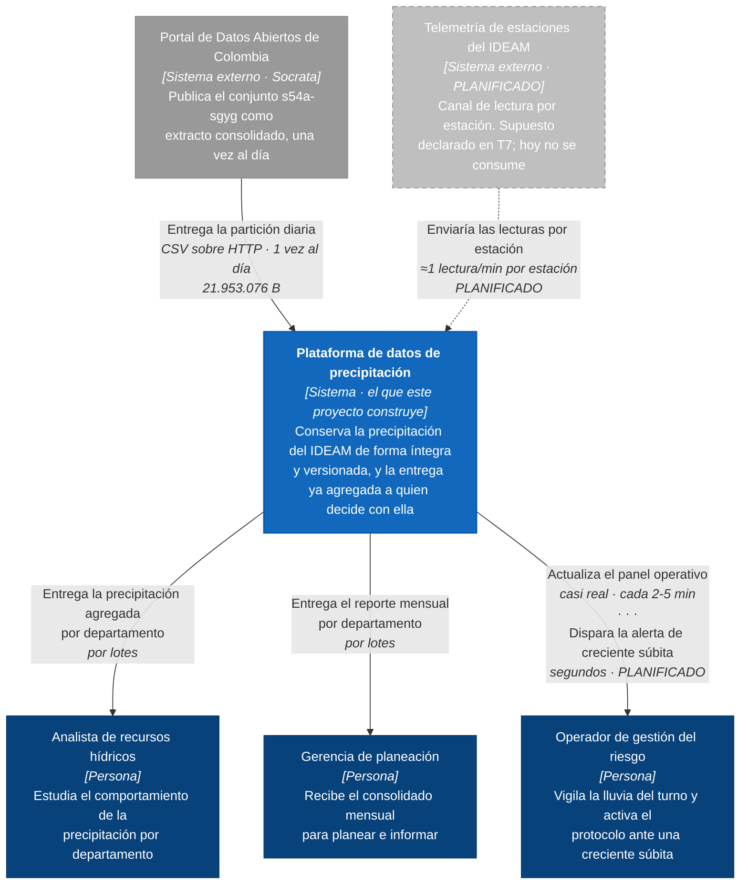
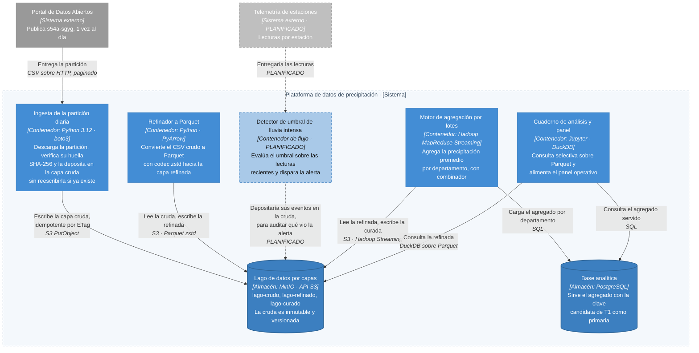

# T8 · Documento de arquitectura del proyecto · Hito A

**Equipo:** `bigdata-ean-ideam`
**Integrantes:** Juan Pablo Castro, Camilo Rojas, Lina Ramírez
**Proyecto:** Plataforma de datos de precipitación del IDEAM (`s54a-sgyg`)
**Fecha:** 2026-09-08

**Repositorio:** https://github.com/JuanPabloCYT/bigdata-ean-ideam

---

## 1. Contexto y fuente de datos

**El sistema.** La plataforma toma la precipitación que el IDEAM publica como dato abierto, la conserva de forma íntegra y versionada en un lago por capas, y la entrega ya agregada a quien tiene que decidir con ella: un analista de recursos hídricos que estudia el comportamiento de la lluvia, una gerencia de planeación que recibe el consolidado mensual por departamento, y —en el diseño que esta arquitectura habilita— un operador de gestión del riesgo que necesita enterarse de una lluvia intensa mientras todavía se puede reaccionar.

**La fuente.** Conjunto «Precipitación» (`s54a-sgyg`) del Portal de Datos Abiertos de Colombia, publicado por el Instituto de Hidrología, Meteorología y Estudios Ambientales (IDEAM), bajo licencia **Creative Commons Attribution–ShareAlike 4.0 International**. Todas las cifras siguientes se midieron en T1 sobre la partición del 22 de junio de 2026, no se estimaron:

| Atributo | Valor medido |
|---|---|
| Volumen de una partición diaria (`S0`) | **21.953.076 bytes** (20,94 MiB), 141.007 registros, 12 columnas |
| Huella SHA-256 de esa partición | `9a8dc75af1969e21ad7e13bddd9fad0291ebbeba2a0b1418cd4237f81a5155be` |
| Factor de expansión en memoria (`k`) | **3,2396** — 71.118.728 bytes como `DataFrame` |
| Frecuencia de actualización declarada | **Diaria** |
| Cadencia real observada entre lecturas | Moda de **1 minuto** (44,16 % de los intervalos); mediana de 2 minutos |
| Tasa de crecimiento interanual medida (`g`) | **−4,78 %** |
| Clave candidata verificada | `codigoestacion` + `codigosensor` + `fechaobservacion`, **0 duplicados** en 141.007 filas |
| Datos personales | Ninguno: estaciones, sensores, coordenadas y mediciones técnicas |
| Formato de entrega | CSV sobre HTTP (API Socrata), paginado |

**Un hallazgo de T1 que condiciona toda la arquitectura.** La tasa de crecimiento medida es **negativa**: el mismo mes calendario pasó de 3.120.484 registros en 2025 a 2.971.298 en 2026. Bajo la tasa histórica no existe un horizonte de saturación, y aun forzando un escenario optimista de +1 % anual el umbral de nodo único se alcanzaría en **313,5 años**. La consecuencia de diseño es directa y se sostiene en todo el documento: **este proyecto no está obligado a distribuirse por presión de volumen.** Las decisiones que siguen se toman por integridad, por reproducibilidad y por frescura del dato, no porque el dato no quepa. Reconocerlo evita el error que el curso combate en cada sesión: adoptar la arquitectura más grande disponible en lugar de la que el problema exige.

---

## 2. Decisión de paradigma

Los requisitos y sus cifras vienen de T7 ([`T7_paradigma.md`](T7_paradigma.md)), donde se justifican uno por uno.

| Requisito | Frescura exigida | Volumen por ciclo | Paradigma |
|---|---|---|---|
| Alerta automática de creciente súbita por lluvia intensa puntual | Segundos (≤ 30–60 s) | Decenas de registros por minuto en la cuenca priorizada | **Flujo** |
| Panel operativo de precipitación para el operador de turno | Minutos (2–5 min) | Cientos de registros cada 5 min (≈98 registros/min medidos) | **Casi real** |
| Ingesta diaria de la partición cruda al lago | Horas | 141.007 registros, 21.953.076 bytes por día | **Lotes** |
| Reporte mensual de precipitación promedio por departamento | Días | ≈4,2 millones de registros de entrada por mes | **Lotes** |

**Paradigma del proyecto: híbrido, con dominancia clara de lotes.** Tres de los cuatro requisitos toleran horas o días, y concentran prácticamente todo el volumen. Un solo requisito —la alerta— exige segundos, y lo hace sobre el volumen más pequeño de los cuatro. Esa asimetría entre *dónde está la urgencia* y *dónde está el volumen* es el hecho del que se deriva la arquitectura de la sección siguiente.

---

## 3. Arquitectura de referencia elegida

**Arquitectura elegida.** Una **vía única por lotes, con un componente de flujo acotado** para el único requisito que exige frescura de segundos. No se adopta Lambda, y la razón no es de costo sino de pertinencia.

**Por qué encaja con el paradigma.** Lambda existe para resolver una tensión concreta: cuando el negocio necesita *el mismo resultado* en dos versiones —uno exacto que el lote produce con latencia alta, y uno aproximado que la capa de velocidad produce al instante— y una capa de servicio debe combinarlos. Su costo principal, la doble implementación de la misma lógica en dos motores, se paga a cambio de esa reconciliación.

En este proyecto esa tensión **no existe**. La alerta de creciente súbita no es una versión aproximada del reporte mensual por departamento: es otro cálculo (un umbral sobre lecturas recientes de una cuenca), sobre otro dato (telemetría de estación, no el extracto diario de Socrata), para otra decisión (activar un protocolo de riesgo, no facturar ni planear). No hay dos vistas del mismo hecho que haya que conciliar, y por tanto no hay nada que una capa de servicio deba combinar. Adoptar Lambda aquí sería pagar su costo íntegro sin recibir su beneficio: exactamente el error que la sesión 8 describe como «elegir del catálogo» en vez de derivar del paradigma.

Kappa tampoco aplica, y falla en las tres condiciones de viabilidad a la vez. El problema no es tratable como flujo (el reporte mensual y la proyección de T3 exigen ver el período cerrado completo); el registro que habría que retener no es propiedad del equipo sino de un tercero sin acuerdo de nivel de servicio; y forzar la ingesta a flujo releería una fuente que, según sus propios metadatos, **solo publica una vez al día** —cómputo continuo para no traer ni un dato nuevo.

**El costo que aceptamos.** Que las dos vías **no comparten linaje**. La vía por lotes tiene trazabilidad completa —de la huella SHA-256 de la partición cruda hasta el agregado por departamento—, mientras que el componente de flujo consumirá un canal de telemetría que nunca pasa por `lago-crudo`. En consecuencia, el umbral de «lluvia intensa» que dispare la alerta y la definición de precipitación que se consolide en la capa curada pueden desalinearse, y **ningún mecanismo lo detectaría solo**: la alerta seguiría disparando y el reporte seguiría cuadrando, cada uno con su propia definición.

Es un costo asumible porque es acotado y tiene mitigación conocida. Se acepta con dos compromisos explícitos: la definición del umbral se documenta en un único lugar del repositorio y se cita desde ambas vías, y el componente de flujo, cuando se implemente, deposita también sus eventos en `lago-crudo` para que la vía por lotes pueda auditar a posteriori qué vio la alerta. Es un costo bastante menor que la doble implementación permanente que cobraría Lambda.

**Por qué no la malla de datos.** La malla resuelve un problema de **escala organizativa**: muchos dominios, muchos equipos y una plataforma central que dejó de dar abasto. Sus cuatro principios presuponen esa pluralidad —dominios dueños de su dato, dato como producto entre dominios, plataforma de autoservicio para que no dependan del equipo central, y gobierno federado *entre* ellos. Este proyecto tiene **un equipo de tres personas, un dominio (precipitación) y una fuente**. No hay un segundo dominio que consuma nuestro dato como producto ni un tercero con quien federar el gobierno: los cuatro principios se quedarían sin contraparte. Adoptarla sería cargar con su costo de coordinación para resolver un problema que el proyecto no tiene. La malla se descarta con argumento, no por desconocimiento; el momento de reevaluarla sería cuando la plataforma sirva a dominios con dueños distintos —por ejemplo, si se sumaran calidad del agua o consumo, cada uno con su propio equipo.

---

## 4. Diagramas C4

Los diagramas se derivan del paradigma de la sección 2: la vía por lotes y el componente de flujo acotado aparecen los dos, y ninguno de los dos se dibuja más grande de lo que la decisión sostiene.

Archivos editables en el repositorio, como exige la práctica:

| Archivo | Qué es |
|---|---|
| [`practica/s08-c4/c4_nivel1_contexto.drawio`](../practica/s08-c4/c4_nivel1_contexto.drawio) | Nivel 1, editable en draw.io |
| [`practica/s08-c4/c4_nivel2_contenedor.drawio`](../practica/s08-c4/c4_nivel2_contenedor.drawio) | Nivel 2, editable en draw.io |
| [`practica/s08-c4/workspace.dsl`](../practica/s08-c4/workspace.dsl) | El modelo como código en Structurizr, nivel Frontera |

### 4.1 Diagrama de contexto · nivel 1



En esta vista, las dos relaciones que la plataforma tiene con el operador —el panel y la alerta— se dibujan sobre una sola línea con las dos etiquetas, por legibilidad; en el archivo editable [`c4_nivel1_contexto.drawio`](../practica/s08-c4/c4_nivel1_contexto.drawio) son dos flechas separadas, cada una con la suya.

Las etiquetas ya dejan ver el paradigma sin necesidad de explicarlo: «1 vez al día» y «por lotes» de un lado, «segundos» y «casi real» del otro. El sistema es **una sola caja**: ninguna pieza interna aparece en este nivel.

### 4.2 Diagrama de contenedor · nivel 2



**Dos advertencias de notación que este diagrama respeta.**

*Primera: el contenedor de C4 no es el contenedor de Docker.* En este proyecto la distinción es literal y no coincide una a una. El «Cuaderno de análisis» y la «Base analítica» sí corren cada uno dentro de un contenedor de Docker declarado en `docker-compose.yml`; el «Lago de datos» corre en el contenedor de MinIO, pero como contenedor de C4 es un **almacén de datos**, no un proceso; y la «Ingesta» y el «Refinador» son procesos de Python que se ejecutan en el equipo del anfitrión, **sin contenedor de Docker alguno**, y aun así son contenedores de C4 de pleno derecho porque se ejecutan de forma independiente.

*Segunda: lo que no está construido se dibuja como no construido.* El «Detector de umbral de lluvia intensa» aparece marcado como **planificado**, con sus relaciones igualmente marcadas. T7 ya había declarado que el requisito de alerta se apoya en un canal de telemetría que el proyecto hoy no consume. Dibujarlo como si existiera haría el diagrama más completo y menos cierto.

Se omiten en este nivel los tres actores del nivel 1, para no repetir el contexto. Se conservan los dos sistemas externos de origen porque son el otro extremo de las relaciones de ingesta: sin ellos, dos contenedores quedarían con una flecha que no llega a ninguna parte.

---

## 5. Decisiones y compromisos

Cada fila es una decisión ya tomada en una tarea anterior, con la medición que la sostiene. Ninguna se justifica por recomendación externa ni por tabla orientativa.

| Decisión | Elección | Fundamento |
|---|---|---|
| Almacenamiento y factor de réplica | **R = 3 para el dato crudo, R = 2 para el derivado** | T3. En la práctica de S03 se detuvo un nodo: el archivo con R = 1 quedó `CORRUPT` con 4 de 10 bloques perdidos y 0 bytes legibles, mientras el de R = 3 siguió `HEALTHY` con MD5 idéntico. La tercera copia cuesta ≈7,5 GB al año a esta escala. El dato crudo es telemetría irrepetible; el derivado se regenera con cómputo |
| Modelo de procesamiento | **MapReduce con combinador, clave `departamento`** | T4. `Reduce shuffle bytes` pasó de **2.398.815 a 5.080** al añadir el combinador: **−99,788 %**. `departamento` tiene 33 valores distintos frente a 524 estaciones, y es la clave de menor cardinalidad que aún responde la pregunta de negocio |
| Formato y codec de la capa refinada | **Parquet con codec `zstd`** | T6, medido sobre la fuente propia. De 21.953.076 B (CSV) a **312.373 B**: −98,6 %. `zstd` es el único que queda entre los dos mejores en las tres columnas a la vez (0,0198 s de escritura, la más rápida de las tres). La consulta de referencia pasó de 0,1429 s a 0,0015 s: **93,5× más rápida** |
| Compromiso CAP | **Disponibilidad, en el requisito de alerta** | T7. Bajo una partición de red, la alerta sigue respondiendo con el último valor conocido aunque esté desactualizado. Un falso negativo por apagón del sistema es más peligroso que una lectura con rezago: el operador puede descartar un dato marcado como viejo, pero no puede reaccionar a una alerta que nunca llegó |
| Sesgo de clave reconocido | Clave compuesta `departamento + codigoestacion` como rediseño | T4. `BOGOTÁ` concentra **67.669 registros, el 47,99 %** — casi tanto como las otras 32 claves juntas. Añadir reductores no lo resuelve: esos registros comparten una sola clave |

**Cómo se encadenan.** No son cinco decisiones sueltas. La réplica 3 protege un dato crudo que es irrepetible, y esa inmutabilidad es la que permite que el refinado a Parquet sea seguro: si la conversión sale mal, la cruda intacta sigue ahí. El formato columnar es a su vez lo que hace barata la consulta selectiva que alimenta el panel operativo del requisito «casi real». Y el compromiso CAP se toma justo en el requisito que la vía por lotes **no** cubre —la alerta—, que es la razón de que el paradigma sea híbrido y no puro.

---

## 6. Reproducibilidad

**El stack.** `docker-compose.yml` levanta tres servicios, cada uno **anclado por digest y no por etiqueta móvil**: `jupyter` (imagen `quay.io/jupyter/scipy-notebook`, cuaderno de análisis), `db` (`postgres`, base analítica) y `minio` (lago de datos por capas). Las credenciales se exigen por variable de entorno con guardas `${VAR:?}`, de modo que el entorno falla de forma explícita si falta el `.env` en vez de arrancar con valores en blanco. Las dependencias de Python están ancladas con `==` en `requirements.txt`.

```bash
git clone https://github.com/JuanPabloCYT/bigdata-ean-ideam.git
cd bigdata-ean-ideam
cp .env.example .env
docker compose up -d
```

**La organización del lago.** Tres cubos, uno por capa, con el prefijo de la clave como convención de partición —no como directorio real, que en almacenamiento de objetos no existe:

```text
lago-crudo/     cruda/ideam_precipitacion/anio=2026/mes=06/dia=22/precipitacion_2026-06-22.csv
lago-refinado/  refinada/ideam_precipitacion/anio=2026/mes=06/dia=22/precipitacion_2026-06-22.parquet
lago-curado/    curada/precipitacion_por_departamento/anio=2026/mes=06/
```

La capa cruda tiene el versionado activado y la ingesta es idempotente por comparación de ETag: una segunda ejecución sobre la misma partición no sobrescribe ni duplica. Detalle completo en [`T5_lago.md`](T5_lago.md).

**La verificación, no la promesa.** Cada entrega de T2 a T7 se comprobó ejecutándola desde un clon limpio, y **dos integrantes lo hicieron de forma independiente y en sistemas operativos distintos**: T5 y T6 fueron reproducidos por Lina Ramírez en Windows ([`T5_verificacion_lina.md`](T5_verificacion_lina.md), [`T6_verificacion_lina.md`](T6_verificacion_lina.md)), obteniendo los mismos tamaños de Parquet byte a byte y la misma diferencia de punto flotante de 5,55 × 10⁻¹⁷. Ese cruce encontró dos fallos reales que un solo equipo no habría visto: en macOS, el Python 3.9 del sistema es demasiado **viejo** para instalar `psycopg[binary]`; en Windows, Python 3.14 es demasiado **nuevo** para `pandas==2.2.3`. Ambos están documentados en [`T5_ejecucion.md`](T5_ejecucion.md) como lo que son —una restricción de versión de intérprete, no un defecto del proyecto.

**El repositorio.** https://github.com/JuanPabloCYT/bigdata-ean-ideam

---

## 7. Referencias

Brewer, E. A. (2012). CAP twelve years later: How the "rules" have changed. *Computer, 45*(2), 23-29. https://doi.org/10.1109/MC.2012.37

Dehghani, Z. (2022). *Data mesh: Delivering data-driven value at scale*. O'Reilly Media.

Instituto de Hidrología, Meteorología y Estudios Ambientales. (2026). *Precipitación* [Conjunto de datos `s54a-sgyg`]. Portal de Datos Abiertos de Colombia. https://www.datos.gov.co/Ambiente-y-Desarrollo-Sostenible/Precipitaci-n/s54a-sgyg

Kleppmann, M. (2017). *Designing data-intensive applications*. O'Reilly Media.

Machado, I. A., Costa, C., y Santos, M. Y. (2022). Data mesh: Concepts and principles of a paradigm shift in data architectures. *Procedia Computer Science, 196*, 263-271. https://doi.org/10.1016/j.procs.2021.12.013

Reis, J., y Housley, M. (2022). *Fundamentals of data engineering*. O'Reilly Media.

Warren, J., y Marz, N. (2015). *Big data: Principles and best practices of scalable realtime data systems*. Manning Publications.

---

## Autoverificación antes de entregar

- [x] La arquitectura elegida se deriva de forma explícita del paradigma de la sección 2.
- [x] Se nombra el costo que se acepta y se descarta la malla con argumento.
- [x] Los dos diagramas C4 respetan las reglas de notación y no confunden el contenedor con Docker.
- [x] Las siete secciones se tejen en un argumento, no se yuxtaponen.
- [x] Cada decisión de la sección 5 tiene su medición o cálculo de respaldo.
- [x] La redacción es clara, el glosario está alimentado y las fuentes se citan en APA 7.
- [x] Los diagramas editables están en el repositorio, no solo como imagen.

---

## Declaración de uso de asistentes de inteligencia artificial

Se utilizó **Claude Code** para estructurar el documento, redactar el argumento de arquitectura y construir los diagramas C4 en sus tres formatos (Mermaid, draw.io y Structurizr).

Ninguna cifra de este documento se escribió de memoria: todas se extrajeron de las evidencias ya versionadas en el repositorio —`docs/T1/evidencia/resultados_medicion.json` para la fuente, T3 para la réplica, T4 para la mezcla y el sesgo, T6 para el formato y T7 para el paradigma— y se verificaron contra el archivo de origen antes de escribirlas. La única pieza del sistema que no está construida, el detector de umbral de la vía de flujo, se marca como planificada en el diagrama y en el texto en vez de dibujarse como existente.
